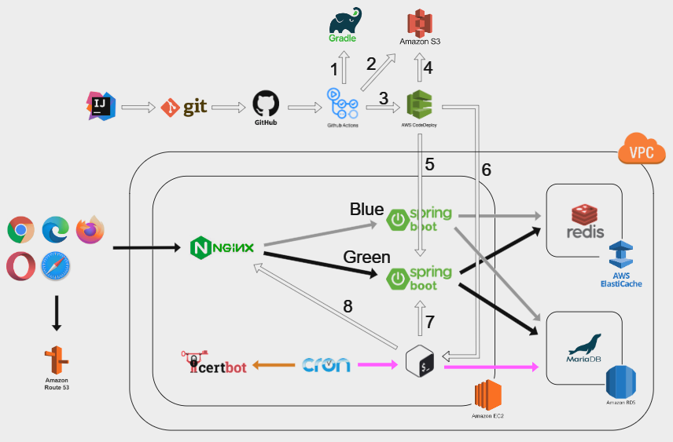
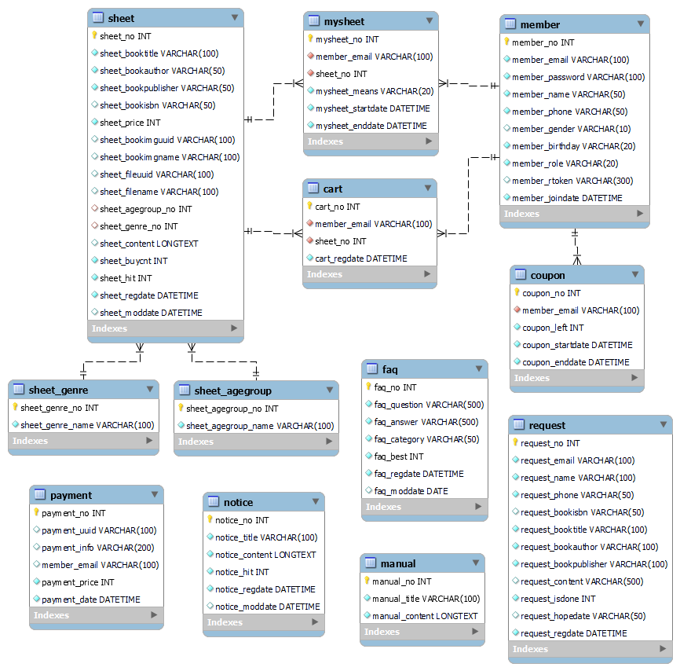

## 1. Introduction
독후활동지를 구매, 다운로드할 수 있는 웹 애플리케이션입니다.

  

## 2. Tech Stack
- Backend : Java 11, Spring Framework 5.3, Spring Boot 2.7, Spring Data JPA 2.7, QueryDSL 5.0, Thymeleaf 3.0, JUnit4, Gradle
- DevOps : AWS EC2(Ubuntu 22.04), AWS RDS(MySQL 8.0), Docker
- Git branch strategy : GitLab Flow
  - 인원별로 역할 분담을 하여 각자 구현해야 할 기능이 구분되어 있기 때문에 기능별로 브랜치를 나누는 대신에 인원별로 브랜치를 나누었습니다. 브랜치를 합쳐야 할 경우에는 먼저 테스트할 브랜치로 머지하여 그 안에서 테스트 후 문제가 없다면 최종적으로 마스터 브랜치로 머지하는 식으로 진행하였습니다.
  - 애초에 필요하다고 생각했던 브랜치들이 있으므로 Github Flow는 고려 대상에서 제외했고 해당 프로젝트의 크기에 비해 Git Flow는 너무 방대하다고 판단하였습니다.

  

## 3. Architecture
- RDS에서 제공하는 자동 스냅샷 기능은 요금이 청구될 가능성이 높다고 판단해 EC2 인스턴스 내에서 직접 데이터베이스 백업을 자동화했습니다.
  - 비밀번호가 유출되지 않도록 mysql_config_editor로 로그인 정보를 저장한 후 그 로그인 정보로 mysqldump를 실행하는 쉘 스크립트 파일을 작성하였습니다.
  - 크론 작업이 실행되지 않았을 경우를 대비해 EC2 인스턴스 내에 anacron를 설치한 후 쉘 스크립트 파일을 /etc/cron.daily에 넣었습니다.
- EC2 내에서 빌드를 할 때에 빌드가 정상적으로 되지 않고 서버가 다운되는 문제가 있었습니다. t2.micro 인스턴스의 RAM이 1GB밖에 되지 않는 것이 원인이라고 가정했습니다. 스왑 파일을 생성하고 스왑 공간에 추가하여 문제를 해결했습니다.

  

## 4. ERD
- 각 테이블에 담기는 데이터
  - mysheet : 보유한 독후활동지
  - coupon : 보유한 쿠폰
  - sheet_genre : 책의 장르
  - sheet_agegroup : 책의 권장 연령

  

## 5. IA

  

## 6. Description

### 사용자
  
- 관리자, 회원, 비회원으로 구분됩니다.
- 인증과 인가는 높은 확장성을 가진 JWT 기반 인증 방식으로 Spring Security와 JJWT를 사용해 처리했습니다.
  - Access Token은 발급 시 쿠키에 저장하며 HTTP Only 설정을 해 XSS 공격에 의한 Access Token 탈취 가능성을 낮추었습니다.
  - Access Token이 탈취되었을 경우의 위험성을 낮추기 위해 Access Token의 만료 시간을 짧게 하고 Refresh Token을 도입하였습니다.
- 비밀번호 찾기 시 이메일 인증 후 임시 비밀번호가 발급됩니다.
  - 메일 발송은 Naver Mail SMTP Server를 통해 처리됩니다.
  - 임시 비밀번호는 난수 예측을 방지하기 위해 SecureRandom으로 생성했습니다.

### 독후활동지
  
- 독후활동지 파일 다운로드 시 관리자가 아니라면 해당 독후활동지 보유 여부 확인 후 다운로드가 진행됩니다.
- 관리자는 독후활동지 관련 정보와 함께 이미지 파일과 PDF파일을 업로드해 독후활동지를 등록하거나 등록된 독후활동지를 수정할 수 있습니다.
  - 독후활동지 등록 혹은 수정 시 원하는 책을 검색해서 책의 정보를 쉽고 정확하게 입력할 수 있도록 ISBN 서지정보 API를 이용했습니다.
- 여러 조건에 맞게 독후활동지를 조회하는 동적 쿼리가 필요해 QueryDSL을 사용했습니다.
  - 모든 독후활동지를 볼 수 있는 기본 메뉴 외에 추가적으로 책의 권장 연령별이나 장르별로 모아서 볼 수 있는 메뉴가 있습니다.
  - 검색 조건으로 선택할 수 있는 옵션에는 제목, 작가, 출판사가 있습니다.
  - 정렬 조건으로 선택할 수 있는 옵션에는 최신순, 조회순, 구매순이 있습니다.

### 구매

- 포트원(구 아임포트)을 사용해 PG사 결제 모듈 연동을 했습니다.
- 구매한 독후활동지, 쿠폰에는 유효 기간이 있습니다.
  - 독후활동지 파일을 분실하였는데 만료일이 지났다면 다시 구매를 해야만 다운로드가 가능합니다.
  - 독후활동지의 유효 기간은 7일, 쿠폰의 유효 기간은 1년입니다.
- 독후활동지를 구매하지 않아도 첫 3페이지를 미리보기로 볼 수 있습니다.
  - PDF파일 업로드 시 미리보기 파일을 원본 파일과 구분해 생성하고 저장하도록 PDFBox를 이용했습니다.
  - 미리보기를 표시하기 위해 PDFjs를 이용했습니다.

### 장바구니

- 장바구니 페이지에서 구매를 하면 구매할 목록을 쿠키에 저장하며 결제 페이지로 이동합니다. 쿠키에 저장된 목록은 결제 페이지와 결제 완료 페이지에서 사용되며 결제 완료 페이지에서 마지막으로 사용 후 삭제됩니다.

### 쿠폰

- 할인된 가격으로 쿠폰을 구매할 수 있으며 쿠폰 하나당 독후활동지 하나를 구매할 수 있습니다.
- 다수의 독후활동지를 한번에 구매하며 쿠폰을 부분적으로 사용할 경우 쿠폰을 사용하지 않는 독후활동지의 금액만 청구됩니다.

### 출제요청
  
- 찾는 독후활동지가 없을 시 관리자에게 출제요청을 할 수 있습니다.
- 출제요청 시 원하는 책을 검색해서 책의 정보를 쉽고 정확하게 입력할 수 있도록 ISBN 서지정보 API를 이용했습니다.
- 관리자 페이지 내에서 출제요청 확인과 답변 여부 업데이트가 가능합니다.

### 알림마당
  
- 이용방법, 공지사항, 자주묻는질문이 있습니다.
- 각 게시판의 게시물 등록은 관리자 페이지에서 가능합니다.
- 게시물 등록 시 작성의 편의성을 높이기 위해 Summernote를 활용했습니다.

### 기타 사항
  
- 입력 데이터의 유효성 검사를 위해 Bean Validation과 정규 표현식을 활용하였고 필요한 경우 Custom Validator를 만들어 적용하였습니다.
- 예외 처리를 위해 @ExceptionHandler를 사용했습니다.
